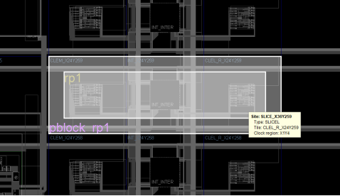

## 1. 基础概念与术语 

### 1.1 动态重配置的定义

​	Dynamic Function eXchange(DFX，也称为动态部分重配置)是一种在FPGA运行时动态修改其部分功能区域的技术。DFX可以在FPGA继续运行时，让用户更改芯片预定义区域的功能，而不影响其他区域的正常运行。相比传统的全局配置方式，DFX具有以下优势：

- 节省硬件成本：可以通过时分复用的方式在同一个区域切换不同功能
- 支持实时更新：无需停止系统运行即可更新部分功能  
- 提升系统灵活性：可以根据需要动态调整功能
- 减少配置时间：部分配置比完整配置速度更快

​	FPGA 设计中的逻辑分为两种不同类型：可重配置逻辑和静态逻辑。静态逻辑在运行期间保持正常工作，不受加载部分比特流的影响。可重配置逻辑则会被部分比特流的内容替换。


​	如上图所示，通过下载任一部分比特流文件(A1.bit、A2.bit、A3.bit 或A4.bit)即可修改重配置块 A 中实现的功能。标记为"FPGA"的区域表示静态逻辑，标记为"重配置块 A"的区域表示可重配置逻辑。

### 1.2 核心术语解析

#### 1.2.1 重配置分区(RP, Reconfigurable Partition)

重配置分区是DFX设计中可以进行动态重新配置的物理区域。它具有以下关键特征：

- 逻辑特征
   - 是HDL设计中的一个模块实例
   - 必须具有稳定的接口定义
   - 可以包含多个子模块

- 物理特征
   - 由一个或多个Pblock定义的器件区域
   - 区域边界必须遵循特定规则
   - 资源独占，不能与其他RP重叠

#### 1.2.2 重配置模块(RM, Reconfigurable Module) 

重配置模块是可以加载到重配置分区(RP)中的具体功能实现。它具有以下特点：

- 实现要求
   - 必须与RP定义的接口完全匹配  
   - 逻辑必须能够完全放入指定的RP区域
   - 每个RM都需要独立的部分比特流文件

- 兼容性要求
   - 同一个RP的所有RM之间必须接口兼容
   - 必须遵循相同的时序和资源约束

#### 1.2.3 静态逻辑与动态逻辑

FPGA的逻辑分为两类：

- 静态逻辑：初始配置后保持不变的部分
    - 在重配置过程中持续运行
    - 包含全局资源（如时钟、配置逻辑等）
    - 管理重配置过程和接口

- 动态逻辑：运行时可重新配置的部分
    - 位于RP内部
    - 可以被不同RM替换
    - 重配置过程中状态不可预测

#### 1.2.4 分区管脚(PartPin)

分区管脚是RP与静态逻辑之间的物理接口点：

- 基本特征
  - 每个管脚都有一个分区管脚(PartPin)
  - 由工具自动布局在RP Pblock范围内
  - 必须是单向的，不支持双向端口
  - 在所有RM配置中保持固定位置
  - 影响布线资源使用和时序性能

- 实现控制
  - 通常自动布局即可满足需求
  - 对于高拥塞或时序关键接口信号，可通过HD.PARTPIN_RANGE约束指导布局
  - 可通过以下语法设置PartPin范围:
    ```tcl
    set_property HD.PARTPIN_RANGE {SLICE_Xx0Yx0:SLICE_Xx1Yy1} [get_pins <rp_cell_name>/*]
    ```
  - 对于负载较少或要求较低的时钟，可将全局时钟降级至区域时钟来提升布局规划灵活性

#### 1.2.5 配置帧(Configuration Frame)

配置帧是FPGA配置的基本单位：

- 7系列器件
  - 配置帧高度与时钟区域对齐
  - 一个帧包含该区域内所有可编程资源
  - 帧边界对资源划分有重要影响

- UltraScale/UltraScale+器件
  - 基于可编程单元(PU)进行重配置
  - 支持更细粒度的重配置

- 通用限制
  - 每个物理可重配置帧仅限包含一个RP
  - 帧内可以包含静态逻辑，但重配置时会被改写
  - 需要考虑帧边界进行资源规划

#### 1.2.6 自下而上综合(Bottom-up Synthesis)

自下而上综合是DFX设计的推荐实施方法，实施要点如下：

- 独立综合每个RM和静态逻辑
- 确保接口定义一致性
- 维护公共时序约束
- 管理资源分配与优化边界
- 验证静态逻辑与RM的接口兼容性
- 使用增量编译提高效率

### 1.3 布局规划相关概念 

#### 1.3.1 Pblock(Physical Block)

Pblock是DFX中的物理约束单元。

| 属性类别 | 属性名 | 功能描述 | 
|---------|--------|----------|
| 基本属性 | 区域定义 | 由一个或多个矩形区域组成 |
| | 资源控制 | 可指定包含或排除特定类型资源 |
| DFX相关 | HD.RECONFIGURABLE | 标记可重配置区域 |
| | SNAPPING_MODE | 控制边界对齐<br>7系列:<br>- OFF: 默认值，不执行调整<br>- ON: 修复所有不间断连续违例<br>- ROUTING: 特殊例外处理<br>UltraScale系列:<br>- 默认开启<br>- 自动确保PU对齐 |
| | CONTAIN_ROUTING | 控制布线约束 |

#### 1.3.2 可编程单元(PU)

UltraScale/UltraScale+架构中的PU布局规则：

- PU基本要求
  - 每种PU类型有特定的相邻CLB要求(5-120个不等)
  - PU内所有资源必须完整包含在分区内
  - 多个PU可共享布线资源 

- 布局考量
  - 需要从必需站点向外构建基础PU
  - 可使用特定工具命令识别PU:
    ```tcl
    get_sites -of_objects [get_tiles -pu -of_objects [get_tiles -of_objects [get_sites <site>]]]
    ```
  - 布线资源PU规则比资源PU规则更严格
  - 建议使工具命令显示PU边界帮助规划

例如，可通过这种方式找到并排 SLICE 站点的可编程单元,这样即可返回基本 PU，其中显示了 SLICE 内的成对 CLB，以及 CLB 之间的共享互连。

```tcl
resize_pblock pblock_rp1 -add [get_sites -of_objects [get_tiles -pu -of_objects [get_tiles -of_objects [get_sites SLICE_X36Y259]]]]
```





#### 1.3.3 布线占板面积(Routing Footprint)

布线占板面积定义RP的布线资源范围：

- UltraScale/UltraScale+特性
  - 支持扩展布线区域
  - 可扩展至Pblock边界外
  - 影响部分比特流大小 
- 布线控制
  - 可通过参数控制扩展
  - 需权衡布线灵活性和比特流大小
  - 建议使用工具命令检查布线占板区域
  

# 2. 器件架构相关规则

FPGA动态重配置架构规则总表

| 规则类别 | 具体规则项 | 7系列器件 | UltraScale/UltraScale+器件 | 规则重要性 |
  |---------|------------|-----------|--------------------------|------------|
  | **A. 资源使用规则** |||||
  | A1. 基础逻辑资源 | CLB资源 | ✓ LUT, FF, SRL<br>✓ 分布式RAM/ROM | ✓ 同7系列<br>✓ 资源配置更灵活 | 必需 |
  || 存储资源 | ✓ RAMB18E1/36E1<br>✓ FIFO18E1/36E1<br>✓ BRAM宏 | ✓ RAMB18E2/36E2<br>✓ FIFO18E2/36E2<br>✓ UltraRAM(URAM288) | 必需 |
  || DSP资源 | ✓ DSP48E1及衍生宏 | ✓ DSP48E2 | 必需 |
  | **A2. 时钟资源** |||||
  | A2.1 时钟容量 | 数量限制 | ⚠️ 每时钟区域最多12个时钟轴<br>⚠️ 静态和动态共享此限制 | ✓ 每时钟区域24个时钟轴<br>✓ 更灵活的分配方式 | 强制 |
  || 布线资源 | ⚠️ 时钟轴预布线占用固定资源<br>⚠️ 影响静态逻辑可用资源 | ✓ 时钟资源更充足<br>✓ 预布线影响较小 | 关键 |
  | A2.2 时钟结构 | 放置规则 | ✗ 时钟资源必须在静态区域<br>⚠️ 需考虑全局布线资源 | ✓ 允许在RP内放置时钟资源<br>⚠️ 需遵循PU规则 | 强制 |
  || 跨区域规则 | ⚠️ 垂直跨越需特别处理<br>⚠️ 需考虑时钟骨干线资源 | ✓ 支持更灵活的跨域分布<br>⚠️ 注意时钟域划分 | 重要 |
  | A2.3 时钟控制 | 使能控制 | ⚠️ 必须在静态区域控制<br>⚠️ 重配置期间保持稳定 | ✓ 支持动态区域控制<br>⚠️ 需要正确的去耦设计 | 关键 |
  || 复位控制 | ⚠️ 需要特殊的复位策略<br>⚠️ BUFGCTRL需注意 | ✓ 自动处理复位<br>✓ 更简单的控制逻辑 | 重要 |
  | A2.4 时钟特性 | 预布线要求 | ⚠️ 所有驱动RP的时钟需预布线<br>⚠️ 需考虑最坏情况资源 | ⚠️ 同样需要预布线<br>✓ 资源限制更少 | 强制 |
  || 动态修改 | ✗ 不支持动态时钟修改 | ✓ 支持MMCM/PLL动态修改<br>⚠️ 需要正确的控制时序 | 重要 |
  | **A3. 接口资源** |||||
  | A3.1 I/O标准 | 一致性要求 | ⚠️ I/O标准必须保持一致<br>⚠️ 必须在静态区域定义 | ⚠️ 方向和标准需保持一致<br>✓ 可以动态调整参数 | 强制 |
  || 可修改特性 | ✗ 不支持动态修改 | ✓ 支持修改驱动强度<br>✓ 支持修改阻抗设置<br>✓ 支持修改斜率控制<br>✓ 支持修改ODT设置 | 重要 |
  | A3.2 I/O配置 | Bank管理 | ⚠️ Bank必须在静态区域<br>⚠️ 不支持动态修改 | ✓ 支持整个Bank重配置<br>⚠️ 重配置影响整个Bank | 强制 |
  || 重配置控制 | ✗ 不支持I/O重配置 | ✓ 支持重配置期间保持状态<br>⚠️ 使用专用全局三态信号 | 关键 |
  | A3.3 DCI规则 | Bank级联 | ⚠️ 需在静态区域管理 | ⚠️ 成员bank不可重复<br>⚠️ 必须完全包含在RP内<br>⚠️ RM间保持一致性 | 强制 |
  || 校准控制 | ✗ 不支持动态校准 | ✓ 重配置后自动校准<br>✓ 无需DCIRESET | 重要 |
  | A3.4 接口时序 | 输入接口 | ⚠️ 建议在静态侧寄存<br>⚠️ 需处理建立/保持时间 | ⚠️ 同样建议寄存<br>✓ 支持更灵活的时序控制 | 建议 |
  || 输出接口 | ⚠️ 建议使用去耦逻辑<br>⚠️ 重配置期间需稳定 | ⚠️ 同样需要去耦<br>✓ 支持更多去耦选项 | 建议 |
  | A3.5 特殊接口 | ISERDES/OSERDES | ✗ 必须在静态区域 | ✓ 可以在RP内使用<br>⚠️ 需要正确的初始化 | 重要 |
  || IDELAYCTRL | ✗ 必须在静态区域 | ✓ 可以在RP内使用<br>⚠️ 需要考虑校准时间 | 重要 |
  | A4. 特殊资源 | 配置逻辑 | ✗ 配置原语需在静态区域 | ✗ 除DNA_PORT外都需在静态区域 | 强制 |
  || PCIe资源 | ✓ PCIe IP核 | ✓ PCIe/CMAC/ILKN | 可选 |
  | **B. 物理规划规则** |||||
  | B1. Pblock规则 | 高度对齐 | ⚠️ 使用RESET_AFTER_RECONFIG时需对齐时钟区域 | ✓ 不强制对齐<br>✓ 自动GSR | 重要 |
  || 宽度对齐 | ⚠️ 必须在资源列间划分<br>⚠️ 不能在INT-INT间划分 | ✓ 基于PU对齐<br>✓ 更灵活的划分 | 重要 |
  || 形状限制 | ⚠️ 严格的连续性要求<br>⚠️ 不建议不规则形状 | ✓ 支持较灵活的形状<br>⚠️ 仍建议规则形状 | 建议 |
  | B2. 最小单元 | 资源粒度 | 基于配置帧 | 基于PU<br>CLB PU：2个相邻CLB<br>BRAM PU：1个RAMBFIFO36, 2个RAMB18，5个相邻CLB<br>URAM PU：1个URAM，30个相邻CLB(每侧15个)<br>DSP PU：1个DSP拼块(含2个DSP站点)，5个相邻CLBz<br>... | 强制 |
  | B3. 布线规则 | 布线限制 | ⚠️ 严格限制在Pblock内 | ✓ 支持布线扩展<br>✓ 可控制扩展范围 | 重要 |
  || 接口布线 | ⚠️ 需要在边界设置PartPin | ✓ 支持更灵活的布线<br>✓ 自动优化布线资源 | 重要 |
  | **C. 特殊功能规则** |||||
  | C1. 复位控制 | 初始化 | ✓ 可选RESET_AFTER_RECONFIG | ✓ 自动GSR控制 | 重要 |
  | C2. 时钟控制 | 时钟数量 | ⚠️ 每区域最多12个时钟 | ✓ 每区域支持24个时钟 | 关键 |
  || 预布线 | ⚠️ 需预布线至所有相关区域 | ✓ 同样需要，但资源更充足 | 关键 |
  | C3. DCI控制 | Bank级联 | - | ⚠️ 不可重复使用bank<br>⚠️ 需在同一RP内 | 必需 |


- ✓ 支持/允许
- ✗ 不支持/禁止
- ⚠️ 特殊规则/限制
