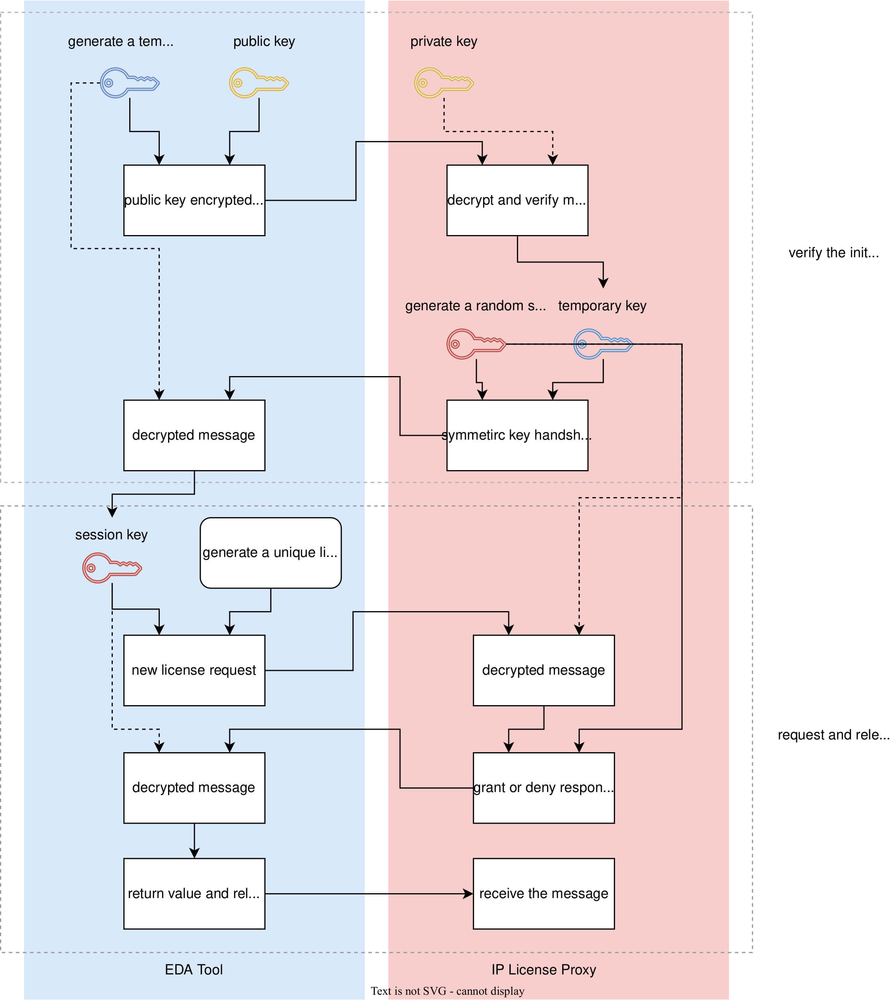

IEEE Std 1735-2014 Ch8 一些整理
## 简介
### 定义
```
`protect license_proxyname="acme_proxy"
`protect license_attributes="USER,MAC,PROXYINFO=1.2"
`protect license_symmetric_key_method="aes128-cbc"
`protect license_public_key_method="rsa"
`protect license_keyowner="ACME", license_keyname="ACME2014"
`protect license_public_key
AV6f6JyGUxBpr49EwxN7jfdUQcRqRFDN7Mto2ltk+emrRCQS+bW/Yvu8U3w9kx7g
rCXFueY/S8lyKUExUP2Yi5C3K9WIFqF7Ov3Hm9/fEumxDzvYkGOGuGu/xv/OYIyb
whEkaiPmVI8+7S/+8NJeOm3BiVaIH5XLcZvz7EW9bvc=
```


- **proxyname**：决定代理运行时所需的环境变量名称

- **attributes**：提供给代理的可选属性，代理可根据这些属性授予或拒绝许可

- **symmetric key method**： 工具与代理间传递信息的对称加密算法

- **public key method**：后文密钥加密算法


- **keyowner & keyname**：每个`license_keyowner/license_keyname`对都与一个`public key`和一个`symmetric method`对应，与之相反，每个`public key/symmetric method`对可以对应多个`license_keyowner`和`license_keyname`，加解密信封中的`license_keyowner/license_keyname`应该是唯一的


- **public key**：用于加密symmetric key，base64编码DER格式，代理可以访问与之匹配的私钥

其中`license_proxyname`和`public key`是必要属性。

### 使用

- **license()**

	位于common block，基本语法：

	`protect control right = license("feature") ? "true_value":"false_value"`

	e.g. `protect control decrypt = license("IP123") ? "true" : "false"`

	license()可以建立与代理间的通信并发出许可请求，如果代理授予许可则返回布尔值TRUE，如果拒绝则返回布尔值FALSE。

- **license_string()**

	基本语法：

	`protect control right = license_string("feature")`

	e.g. `protect control myrights = license_string("IP789")`

	如果代理拒绝许可请求license_string()返回空字符串。

### 多个信封

- 不同的**license_proxyname**

	通常使用不同的代理，license_proxyname用于查找代理socket地址，如果多个license_proxyname指向同个代理则共享代理并建立自己的socket连接。

- 相同的**license_proxyname**和不同的**license_keyowner**/**license_keyname**

	使用同个代理，但使用不同的socket连接和symmetric key。

- 相同的**license_proxyname**、**license_keyowner**、**license_keyname**和不同的属性

	使用同个socket连接，工具为每个唯一的属性组合发起许可请求。

- 相同的**license_proxyname**、**license_keyowner**、**license_keyname**和属性

	复用与之相同许可请求的返回结果。

## 通信步骤
   ### 连接代理（Contact the proxy）

工具从解密信封中提取proxy name、public key owner、public key name和public key，proxy name和public key（应和整个public key相比较而不仅仅是public key name）都应和现存socket对应proxy name/public key相同，否则新开一个socket。

工具需要设置代理运行时所需的环境变量名称即`license_proxyname + _LICENSE_PROXY`，如`protect license_proxyname="acme_proxy"`决定环境变量名称为`ACME_PROXY_LICENSE_PROXY`，其值格式为`port@host`，如`8888@127.0.0.1`。检查许可时如果未设环境变量或其值格式错误，那么工具可以发出警告，相关条件权限按照false处理。

   ### 验证初始握手（Verify the initial handshake）

1.  IP指定代理的public key owner、key name、public key、代理公钥和对称加密算法，工具生成一个随机的临时对称加密密钥（temporary key ）并使用公钥加密得到加密信息。

   工具->代理传输信息格式如图所示，`2字节L的长度 + 'P'（类型信息） + 2字节tag长度 + tag（license_keyowner, license_keyname）＋ 公钥加密信息`。如果代理使用 4096 位密钥那么加密信息长度为 512 字节，keyowner为owner，keyname为key，那么socket传输信息共计 526 字节，`2字节长度（0x02和0x0C） + 'P' + 2字节tag长度（0x0和0x9）+ tag（owner,key）＋ 512字节加密信息`。

   

2.  代理接收信息、确定消息类型、提取key owner和key name并使用其对应的私钥解密，在验证解密信息大小与预期的对称密钥相同后，生成新的随机对称密钥（SessionKey）并与socket关联，而后创建伪随机IV，使用temporary key（代理接收并解密后得到）和新IV加密SessionKey，最后将信息通过对称密钥握手（symmetric key handshake）命令发送给工具。

代理->工具传输信息格式如图所示，`2字节L的长度 + 'S'（类型信息） + 初始向量IV ＋加密信息ENC`（由`'K' + 会话密钥SessionKey`加密得到）。如果symmetric key method选择 AES256 ，那么socket传输信息共计 67 字节，`2字节L的长度 + 'S'（类型信息） + 16字节初始向量IV ＋ 48字节加密信息ENC（'K' ＋ 32字节会话密钥SessionKey，四舍五入到下一个block大小）`。

   

如果代理无法识别tag、解密temporary key失败或temporary key与symmetric key method不符，代理关闭socket。工具检测到过早关闭的socket可将其视为拒绝请求（返回FALSE或空字符串），握手失败可能原因是代理环境变量设置错误、代理未在目标主机上运行或与主机不兼容等，工具可以选择向用户报告这些原因。

3.  工具接收并使用temporary key解密信息，验证命令类型是否为对称密钥握手，信息是否解密成功，SessionKey是否符合symmetric key method指定算法，最后将其与socket关联。如果无法成功解密信息或SessionKey与symmetric key method不符，可将其视为代理拒绝请求（返回FALSE或空字符串）。

### 请求许可（Request a license）

对于每个唯一的代理和代理公钥对，上述连接代理和验证初始握手步骤仅需运行一次，一旦建立安全信道，许可相关请求处理可以开始进行。工具为每个许可请求生成唯一的长度和IV相同的id（即socket中的id都应是唯一的），工具和代理使用它来区分不同的许可。

工具->代理传输信息格式如图所示，`2字节L的长度 + 'S'（类型信息） + Id ＋加密信息ENC`（由SessionKey和Id作为IV加密`'N' + request string`得到）。


其中request string是一个以逗号分隔`name=value`的列表，包含许可特性或right block中列出的属性，例如`keyname=ACME2014,license=abc,MAC=123456789012`。其他可支持的属性有：

  - HOSTNAME： 符合IEEE Std 1003.1 (POSIX)标准，由工具通过`gethostname()` API获取

  - MAC：IEEE Std 802指定的48位通用LAN MAC地址，格式为十六进制字符串。对于拥有多个MAC地址主机，可以对其接口排序再选择第一个接口返回的地址。POSIX系统中可以通过指令`ifconfig`获取

  - USER：POSIX指定进程的实际用户ID用户名，由工具通过`getpwuid(getuid())`API获取

  - PROXYINFO=value： value主要由数字组成，可以包括`_`/`-`/`.`，不可以包括逗号或双引号，整个字符串不应被工具验证或修改，而应被传输到代理由其解析，一个典型用法是指定代理允许的最低版本

### 授予许可（Grant a license）

代理接收信息并解密，验证命令类型为许可请求后解析信息并决定是否授予许可。代理->工具传输信息格式如图所示，`2字节L的长度 + 'S'（类型信息） + Id ＋加密信息ENC`。


被加密的具体内容分为以下几种情况：

  - **license()** + 同意请求：`'G' + request string`
  - **license()** + 拒绝请求：`'D' + request string + ":All licenses are in use"`
  - **license_string()** + 同意请求：`'G' + request string + ":" + return string`
  - **license_string()** + 拒绝请求：`'D' + request string + ":All licenses are in use"`


### 检查心跳（Check for heartbeats）

基础socket机制允许工具和代理检测socket是否断开连接，代理可以立即收回socket上的任一许可。当检测到socket已断开，工具可以立即停止对处理IP。工具可以尝试重新建立通信、获取许可并恢复处理IP。心跳参数是一个4位整数的时间戳（UNIX时间），工具和代理应保证时间戳的合理性，即当前时间的几百秒以内，每个许可的时间戳升序排列。工具和代理心跳包使用不同的标识符以防止代理发送内容被替换为从工具发送到代理的信息。
### 释放许可（Release a license）

工具处理完许可后向代理发送命令释放该许可，断开socket也可以释放许可，但代理可能会保留许可一段时间。工具也可以用socket处理其他许可请求或保持open状态一段时间以避免新请求建立新连接。


*代理命令（license proxy commands）*

|                  命令                   | 标识符 |    方向    |       参数        |
| :-------------------------------------: | :--: | :--------: | :-----------------: |
| 对称密钥握手（symmetric key handshake） | 'K'  | 代理->工具 |   共享的对称密钥    |
|   新的许可请求（new license request）   | 'N'  | 工具->代理 |     许可参数      |
|    授予许可（grant license request）    | 'G'  | 代理->工具 | 许可参数+可选返回 |
|  拒绝许可请求（deny license request）   | 'D'  | 代理->工具 | 许可参数+拒绝原因 |
|      工具心跳包（tool heartbeat）       | 'H'  | 工具->代理 |       时间戳        |
|      代理心跳包（proxy heartbeat）      | 'P'  | 代理->工具 |       时间戳        |
|       释放许可（license release）       | 'R'  | 工具->代理 |         N/A         |

*整个传输信息过程如图所示*




